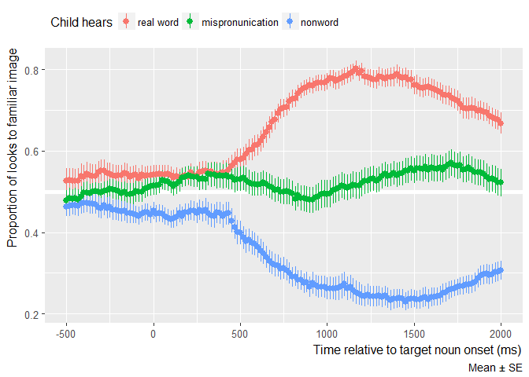

<!-- README.md is generated from README.Rmd. Please edit that file -->
LawEdwards2015
==============

This package contains eyetracking data from the mispronunciation experiment reported in [Law and Edwards (2015)](https://www.ncbi.nlm.nih.gov/pmc/articles/PMC4618685/).

The purpose of this package is to provide pre-packaged eyetracking data from a well-documented experiment to support testing and development of code and statistical models about eyetracking data. This package is *not* an open-data or reproducible-research supplement for that publication.

Installation
------------

You can install LawEdwards2015 from github with:

``` r
# install.packages("devtools")
devtools::install_github("tjmahr/LawEdwards2015")
```

Example
-------

This package contains frame-by-frame looking data:

``` r
library(LawEdwards2015)
library(dplyr, warn.conflicts = FALSE)

law_edwards_2015
#> # A tibble: 627,912 × 15
#>      Subject BlockNo TrialNo Condition ImageL   ImageR WordGroup
#>        <chr>   <int>   <dbl>     <chr>  <chr>    <chr>     <chr>
#> 1  001C45FS1       1       1       FAM   cat1 opossum1       FAM
#> 2  001C45FS1       1       1       FAM   cat1 opossum1       FAM
#> 3  001C45FS1       1       1       FAM   cat1 opossum1       FAM
#> 4  001C45FS1       1       1       FAM   cat1 opossum1       FAM
#> 5  001C45FS1       1       1       FAM   cat1 opossum1       FAM
#> 6  001C45FS1       1       1       FAM   cat1 opossum1       FAM
#> 7  001C45FS1       1       1       FAM   cat1 opossum1       FAM
#> 8  001C45FS1       1       1       FAM   cat1 opossum1       FAM
#> 9  001C45FS1       1       1       FAM   cat1 opossum1       FAM
#> 10 001C45FS1       1       1       FAM   cat1 opossum1       FAM
#> # ... with 627,902 more rows, and 8 more variables: TargetWord <chr>,
#> #   CarrierOnset <dbl>, TargetEnd <dbl>, TargetLocation <chr>,
#> #   DistractorLocation <chr>, Time <dbl>, GazeByImageAOI <chr>,
#> #   GazeByAOI <chr>
```

Use `AggregateLooks()` from the [lookr package](https://github.com/tjmahr/lookr) to get looking proportions collapsed across trials.

``` r
aggregated <- law_edwards_2015 %>% 
  filter(between(Time, -500, 2000)) %>% 
  # First two trials were familarization
  filter(Condition != "FAM") %>% 
  lookr::AggregateLooks(Subject + Condition + Time ~ GazeByImageAOI) %>% 
  tibble::as_data_frame()
aggregated
#> # A tibble: 15,855 × 12
#>      Subject Condition      Time Distractor Target Elsewhere   NAs Others
#>        <chr>     <chr>     <dbl>      <int>  <int>     <int> <int>  <dbl>
#> 1  001C45FS1        MP -499.6380          7      5         0    12      7
#> 2  001C45FS1        MP -482.9834          7      5         0    12      7
#> 3  001C45FS1        MP -466.3288          7      5         0    12      7
#> 4  001C45FS1        MP -449.6742          7      5         0    12      7
#> 5  001C45FS1        MP -433.0196          7      5         1    11      7
#> 6  001C45FS1        MP -416.3650          7      6         0    11      7
#> 7  001C45FS1        MP -399.7104          8      6         0    10      8
#> 8  001C45FS1        MP -383.0558          8      6         0    10      8
#> 9  001C45FS1        MP -366.4012          8      6         0    10      8
#> 10 001C45FS1        MP -349.7466          8      6         0    10      8
#> # ... with 15,845 more rows, and 4 more variables: Looks <dbl>,
#> #   Proportion <dbl>, ProportionSE <dbl>, PropNA <dbl>
```

Make a nice plot of the raw data.

``` r
library(ggplot2)
theme_aligned <- theme(
  axis.title.x = element_text(hjust = .995), 
  axis.title.y = element_text(hjust = .995))

condition_labels <- c(
  "real" = "real word",
  "MP" = "mispronunication",
  "nonsense" = "nonword"
)

aggregated$heard <- aggregated$Condition %>% 
  factor(levels = names(condition_labels), labels = condition_labels)
  
ggplot(aggregated) + 
  aes(x = Time, y = Proportion, color = heard) + 
  geom_hline(yintercept = .5, size = 2, color = "white") +
  stat_summary(fun.data = mean_se, geom = "pointrange") + 
  labs(x = "Time relative to target noun onset (ms)", 
       y = "Proportion of looks to familiar image",
       color = "Child hears",
       caption = "Mean ± SE") + 
  theme_grey(base_size = 12) + 
  theme_aligned + 
  theme(legend.position = "top",
        legend.justification = "left") 
```



Compare to [Figure 2](https://www.ncbi.nlm.nih.gov/pmc/articles/PMC4618685/figure/F2/) of the article. (The data for that plot used was pre-processed to remove trials with excessive missing and to downsample looks into 50 ms bins, whereas this plot uses raw data).
